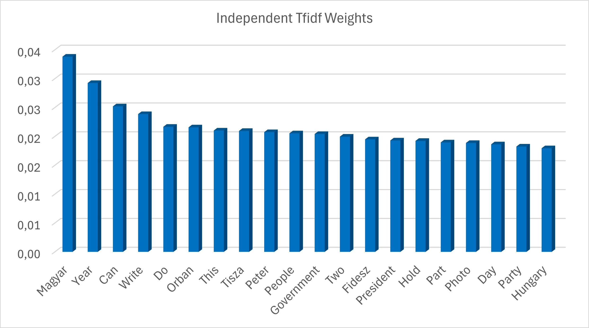
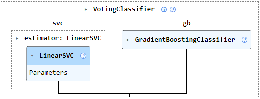
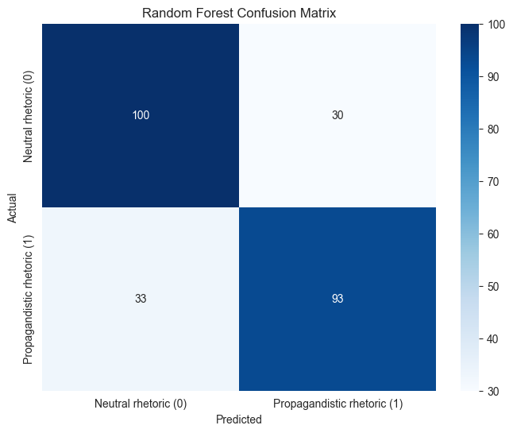

# Project Documentation

### [1. Data Collection](1.-data-collection)

## 1. Data Collection
The data was collected between *December 2025* and *January 2026*. The model uses approximately **1,700 articles**, half of which are propaganda rhetoric articles and half of which are independent rhetoric articles. Since the data was collected only in the last month, it can only produce reliable results in *current politics*. Labels reflect source affiliation and rhetorical style, *not factual correctness*. Also, it can only be used with Hungarian-language texts/articles.

The data collection process consisted of two main phases, ensuring relevance and a balanced data set.

### a) URL Discovery via RSS Feeds 
I classified the news sources into two categories: *Independent* and *Pro-Government*. For data collection, I used the `feedparser` library to monitor RSS feeds.
- **Keyword filtering:** I only collected articles whose title or summary contained specific *political keywords* (e.g., Brussels, war, EU, Orban, Peter Magyar). This ensured that the model learned political rhetoric rather than sports news or tabloid gossip.
- **Duplication filtering:** Before each save, the system checked for existing URLs, thus avoiding distortion of the data set with duplicate content.

### b) Article Scraping
Based on the collected URLs, I downloaded the full text of the articles using the `newspaper3k` library. I recorded the data in CSV format (`url`, `title`, `text`, `label`), where the `label` (0 or 1) indicates the category of the news source. Labels correspond to media alignment, not individual article intent.

### Usage
Let's look at an example code of how can we expand the CSV file with independent articles:
```python
from collect_urls import collect_news
from process_articles import process_articles

# Collecting new URLs using RSS feeds
KEYWORDS = [...]
collect_news(category_id=0, output_file='../../data/0urls.txt', keywords=KEYWORDS, max_items=200) # It is not necessary to specify the max_items or keywords from the outset.

# Downloading the articles, and attach them to the CSV file
process_articles(source_file="../../data/0urls.txt", label=0) # 0 = Independent, 1 = Pro-Government
```
## 2. Preprocessing
When preparing the data, the goal was to reduce the noise level of the text and standardize the encoding of the content. To do this, I used the SpaCy (Hungarian language model) library through an optimized nlp.pipe process.
### a) The Cleaning Workflow
The `spacy_preprocess_pipe` function performs the following steps: 
- **Tokenization and Filtering:** I removed stop words (conjunctions, articles) and punctuation marks, as these do not carry political meaning in terms of rhetorical analysis. 
-  **Lemmatization:** I reduced every word to its root form. This is a critical step in Hungarian due to the high variability of inflection, as it allows the TF-IDF model to combine words with the same meaning. 
- **Numerical Standardization:** I replaced numbers with a uniform `NUM` token. This helps the model recognize statistical-based reasoning without treating each unique year or amount as a separate feature. 
- **Title and Content Merging:** I treated the article title and body text as a single unit, as titles often contain the strongest rhetorical markers.
### b) Efficiency and Incremental Loading
- **Batch Processing:** Using SpaCy `nlp.pipe` allows for batch processing of texts, which is significantly faster than calling the model line by line.
- **Persistent Caching:** I introduced an incremental processing logic. The program checks the URLs already processed in `processed_articles.csv` and only runs new articles through the NLP pipeline. This saves significant computing capacity when expanding the database.

## 3. Feature Engineering
I used a two-step process for the mathematical representation of the texts: *CountVectorizer* to measure frequencies and *TfidfTransformer* for weighting.
### a) CountVectorizer:
When configuring CountVectorizer, I made several critical decisions to improve the accuracy of the model:
- **N-gram Range (1, 2):** I examined not only individual words (unigrams) but also word combinations (bigrams). This is essential in political rhetoric, where expressions such as "Peter Magyar" or "European Union" have a much stronger meaning than their individual words.
- **Max Features (2000):** I limited the vocabulary to the 2000 most important elements. This helps prevent overfitting and ensures that the model focuses only on the most statistically relevant rhetorical elements.
- **Min_df / Max_df:** I excluded words that appear in more than 90% of the documents (too common, no distinguishing power), thus refining the model's focus.
### b) TfidfTransformer
I weighted the raw frequency data using TfidfTransformer to give more weight to less frequent but more informative words. I used the *sublinear_tf=True* setting, which uses logarithmic scaling (1 + log(TF)). This prevents a word from becoming overly dominant simply because it is repeated many times in an article (for example, in a long list).

## 4. Rhetorical Analysis from TF-IDF Weights

### a) Analysis of Independent Rhetoric
As can be seen in the attached graph, typical of independent news articles, the TOP 20 most frequently used words are mostly verbs and common nouns, with fewer proper nouns among them. These words are also generally characterized by emotional neutrality, with no words describing direct fear or danger appearing among them.


### b) Analysis of Propagandistic Rhetoric
On the other hand, looking at the top 20 words with the greatest weight in propagandistic rhetoric, we can see that more proper nouns appear here. Péter Magyar's name appears first (presumably, but Magyar also means "Hungarian" in Hungarian), followed immediately by his party, Tisza. This suggests a strong thematic emphasis in pro-government media during the observed time period. In addition, it is also noticeable that bigrams, expressions consisting of two words, have already appeared here, which the algorithm has successfully recognized (Peter Magyar, Viktor Orban, Tisza Party). The government's current thematic focus is clearly visible here: Peter Magyar, Tisza Party, and the Ukrainian-Russian conflict, which is receiving a lot of attention from the government media.

### c) Lexical Divergence by Tfidf Weights
The thematic distribution is clearly visible in this figure. We can see that the biggest difference is between the mention of the ruling party (Fidesz) and the largest opposition party (Tisza Party). While the largest opposition party is most often mentioned by the government press, the ruling party is most often mentioned by the opposition press. It is also noticeable that, as the government places great emphasis on fear of Ukraine, the words Ukrainian/Ukraine are given significantly more weight in the model for the government media than for the independent media, while Russia is divided equally between the two. This suggests that while Russia is an unavoidable geopolitical factor on both sides, Ukraine is a specific "target" or "source of danger" in government rhetoric. Here, too, frightening words such as "war" appear, which also occur more frequently in the government media than in the independent press.

## 5. Final Ensemble Model
For this project, an ensemble model was selected, combining a LinearSVC and a Grandient Boosting Classifier in a Voting Classifier using a hard voting strategy. This model combines the predictions of multiple base estimators, ensuring a robust majority-rule decision. 
LinearSVC was chosen for its strong performance in high-dimensional sparse text representations, while Gradien Boosting complements it by capturing non-linear interactions between feaures. This model was then saved in a pipeline named `ensemble_pipeline_id1_0_89.joblib`.
<div align="center">



</div>
The ensemble approach was motivated by the observation that different models exhibit complementary error patterns. Wheile LinearSVC tends to be conservative in predicting propagandistic rhetoric, Gradient Boosting impoves recall by identifying subtler stylistic rules.

### Results
The model achieved a strong accuracy of 0.89. This means that it performed better than the baseline model, which achieved an accuracy of 0.51. We can therefore conclude that the model did indeed learn from the data and that texts containing propagandistic rhetoric have characteristics that distinguish them from the style of the independent press.
<div align="center">

|          | precision | recall | f1-score | support |
|----------|-----------|--------|----------|---------|
| 0        | 0.85      | 0.95   | 0.90     | 111     |
| 1        | 0.94      | 0.83   | 0.88     | 105     |
| accuracy |           |        | 0.89     | 216     |

</div>

The high precision for the 'propagandistic' label indicates a conservative classification strategy, minimizing false accusations (False Positives). Consequently, the model exhibits high recall for the 'independent' label, ensuring that non-manipulative content is rarely misclassified. While this approach might result in some propaganda remaining undetected, it prioritizes the avoidance of 'negative criticism' or unjust labeling of independent outlets.
<div align="center">


</div>

## 6. Other experimental models
### a) Decision Tree
This model is easy to understand and its operation can be traced back, as it is clear to see which word led to the decision. In addition, it is capable of recognizing complex rules that a simple (e.g., linear) model cannot. However, since there are many features in text classification, this model can overfit the training data, which leads to it learning too much noise, or the addition of a single new article to the training data can completely rearrange the tree structure.
<div align="center">

|          | precision | recall | f1-score | support |
|----------|-----------|--------|----------|---------|
| 0        | 0.75      | 0.45   | 0.56     | 130     |
| 1        | 0.60      | 0.84   | 0.70     | 126     |
| accuracy |           |        | 0.64     | 256     |

</div>

Another characteristic of this model is that it gave more false alarms to propagandistic articles, i.e., it repeatedly labeled independent articles as propagandistic. This model was more confident in its assessment of independent articles, so it labeled many propagandistic articles as independent.

<div align="center">


</div>

### b) Random Forest
While a single decision tree tends to get lost in the details (overfitting), Random Forest averages the opinions of many trees, thus providing a much more stable result; the model will not focus on the unique noise of a single article. It generalizes much better on the test data. This model can accurately tell which words contributed most to the decision globally, at the forest level. However, it is less suitable for text classification, as it performs poorly with sparse data. In addition, it is difficult to understand how it works, as 300 trees worked together here.
<div align="center">

|          | precision | recall | f1-score | support |
|----------|-----------|--------|----------|---------|
| 0        | 0.75      | 0.77   | 0.76     | 130     |
| 1        | 0.76      | 0.74   | 0.75     | 126     |
| accuracy |           |        | 0.75     | 256     |

</div>
Here, it can be seen from the data and the confusion matrix that it performed better than the previous, simple Decision Tree model. It flagged fewer independent articles as propagandistic, and in fact, it is now balanced, making approximately the same number of errors in both groups, as the precision and recall values for both groups are close to each other. However, it would be correct here if the label precision value containing propagandistic rhetoric were higher, as this would make the model more reliable and ethical.
<div align="center">



</div>

## 7. Future Scalability
Using the attached .py files, it is also possible to expand the model's dataset in order to increase its potential performance. In addition, with a small modification, it is also possible to use the model for other languages in the preprocessing process. Furthermore, the next stage of the project will be to incorporate parliamentary speeches into the model, enabling it to recognize many more rhetorical patterns.

## 8. Ethical Considerations & Disclaimer
This tool is intended for academic research purposes only.

- **Subjectivity**: Defining "propaganda" is inherently complex; the model reflects the patterns found in the training data.
- **No Truth-Discovery**: This model detects rhetorical patterns, not the factual accuracy of the content.
<!--stackedit_data:
eyJoaXN0b3J5IjpbLTE4NTM1MjgwMTgsMTQzMzM5MDgzMiwtMT
A5MTAwODMxNiwtMTgxMTMzMjU3MSwtMTIzMzcwMjIzNSwtMTc4
MTI0MTgzMywyMDQ4MTE5OTgyLC0xNDU0MjgyOTkyLC0zODM1Mz
c5NDYsMTY1MTcwMDExMyw5NzYzMTE1NDUsMTU4Nzg0NDgzMSwt
MTc0MjI0ODk3MywtMzA3MjM5MDQ0LDE4NzgwMzc5NDEsMjAyNz
E2Mzc1NywtMTgwMTUzNjAyMiwxMTY1ODEzMzgyLC0xMzA1NDU2
NzU4LC0xMzA2NzkyNzIxXX0=
-->